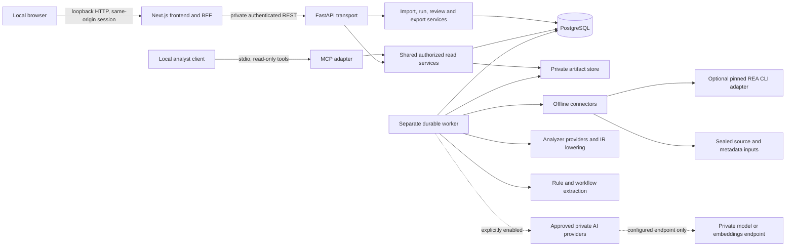

# LAIP architecture and interface specification

**Version:** 0.1.0. **Date:** 2026-10-07. **Status:** step 2 design gate; no runtime service, parser, database migration or deployment is implemented by this document.

LAIP is an offline knowledge platform for understanding supplied legacy applications. The first delivery is a single-user localhost prototype with synthetic fixtures. It imports inert source and metadata, records an inventory, performs explicitly bounded static analysis, extracts reviewable rules, retrieves supporting evidence, and exports linked knowledge. Live IBM i collection, broader language coverage, enterprise identity and other platforms require later implementation and validation. Application modernization and code translation are outside scope.

The [requirements backlog](laip-backlog.md) allocates every substantive requirement visible in the original, truncated attachment. The [execution plan](plans/laip-execution.md) determines implementation order. The [REA assessment](rea-assessment.md) determines adapter and parser reuse decisions. The [canonical contracts](contracts/0.1.0/README.md) and [JSON Schema](contracts/0.1.0/laip.schema.json) own record fields, identity algorithms and validation invariants; this specification owns components, transport projections, persistence and operational behavior. Names below refer to those canonical definitions unless a transport-only type is explicitly defined.

## 1. Topology and ownership

Compose initially runs frontend, API, worker and PostgreSQL on a private network with named private volumes. Only the frontend/BFF publishes `127.0.0.1:3000`; IPv6 loopback is optional through an explicit equivalent mapping. API, worker and database publish no host ports. Development direct API access, if needed, is a separate loopback-only profile with the same token and Host/Origin checks. No public MCP HTTP transport is provided. The MCP process is launched locally and calls the same read service layer through authenticated private REST or an in-process service adapter; it cannot bypass source policy.

Python/FastAPI/Pydantic own domain validation and application services; Next.js/TypeScript/Tailwind own the web interface. PostgreSQL owns metadata, relationships, jobs and review history. Local volumes own private immutable artifact bytes. A TypeScript parser sidecar is conditional on the RPGLE isolation decision, not a default extra service. There is initially no message broker, graph database, hosted model, model download or enterprise connection. pgvector has an explicit future migration/interface seam and remains disabled until an approved private embedding endpoint and matching model/dimension contract are validated.

## 2. Components and typed interfaces

All calls carry `RequestContext {actor_id, request_id, authorized_namespace, source_policy_version}`. Workers additionally carry a `WorkContext {run_id, job_id, lease_token, fence, cancellation, limits}`. Namespace and permitted artifact IDs come from authorized service context, not provider claims. Expected failures use a typed diagnostic/error code; unexpected exceptions become redacted `EXECUTION_FAILED`. Results contain explicit diagnostics and limitations even when partially useful. Components receive interfaces, not raw SQL connections, unrestricted filesystem paths or command strings.

| Original component / supporting component | Interface signatures and responsibility | Expected errors |
| --- | --- | --- |
| Enterprise Connector Layer | `describe() -> ProviderDescriptor`; `probe(CollectionScope, context) -> ProbeReport`; `collect(CollectionRequest, context) -> AsyncIterator<CollectionItem>`; inert input/metadata collection with scope and effects | `MISSING_SOURCE`, `UNSUPPORTED_OPERATION`, `INSUFFICIENT_AUTHORITY`, `SOURCE_CHANGED`, `LIMIT_EXCEEDED` |
| Legacy Application Discovery Engine | `discover(CollectionSnapshot, ResolutionPolicy, context) -> DiscoveryBatch`; normalized entities, source/object links, manifest membership and inferred membership proposals | `INVALID_METADATA`, `AMBIGUOUS_REFERENCE`, `MISSING_REFERENCE` |
| Static Analysis and Reverse Engineering Engine | `supports(ArtifactDescriptor, AnalysisOptions) -> SupportReport`; `analyze(AnalysisInput, context) -> AnalysisBatch`; grammar parsing, source-preserving IR, declarations, dependency proposals and diagnostics | `UNSUPPORTED_DIALECT`, `DECODE_FAILED`, `PARSE_FAILED`, `MISSING_INCLUDE`, `CANCELLED` |
| Business Logic Extraction Engine | `extract(IRBundle, ResolvedGraphSlice, RulePolicy, context) -> RuleBatch`; deterministic conditions/actions/calculations and bounded workflow proposals | `ANALYSIS_BARRIER`, `UNRESOLVED_REFERENCE`, `PATH_LIMIT_REACHED` |
| Application Knowledge Graph | `resolve(TargetReference, ResolutionContext, SnapshotId) -> ResolutionResult`; `neighbors(GraphQuery) -> GraphPage`; `paths(PathQuery) -> PathPage`; default resolved edges only | `SNAPSHOT_NOT_READY`, `LIMIT_EXCEEDED`, `INVALID_SCOPE` |
| Evidence and Provenance Management | `validate(EvidenceBatch, lineage) -> ValidationReport`; `publish(batch, transaction) -> EvidenceIds`; `get(EvidenceId, SnapshotId, context) -> EvidenceView`; immutable observations, derivation DAG and review projection | `INVALID_DIGEST`, `INVALID_SPAN`, `MISSING_EVIDENCE`, `CROSS_NAMESPACE_REFERENCE` |
| LLM Context Generation Engine | `retrieve(RetrievalRequest, context) -> RetrievalResult`; `build_context(ContextRequest, context) -> ContextPackage`; optional `explain(PrivateExplanationRequest) -> CitedInterpretation` | `BUDGET_EXCEEDED`, `AI_DISABLED`, `INVALID_CITATION`, `MODEL_UNAVAILABLE` |
| Knowledge Repository | `EntityRepository`, `SnapshotRepository`, `EvidenceRepository`, `RuleRepository`, `ReviewRepository`, `RunRepository`, `JobRepository`, `ChunkRepository`, `AuditRepository`; transactions only around bounded reads/writes | `CONFLICT`, `NOT_FOUND`, `STORAGE_UNAVAILABLE` |
| Enterprise API | typed REST command/read handlers below; MCP read handlers below; transports validate/authenticate then call common services | stable HTTP/MCP errors below |
| Web-Based UI | generated typed client `import/run/cancel/list/detail/graph/evidence/revise/review/retrieve/export`; browser uses BFF only; UI presents classification, resolution and review separately | accessible empty, partial, unavailable, stale review and error states |
| Artifact storage | `stage(stream, limits) -> StagedBlob`; `publish(stage, expected_sha256) -> BlobRef`; `open(BlobRef, byte_range) -> stream`; `verify(BlobRef) -> DigestReport`; `delete_unreferenced(BlobRef, gc_epoch)` | `INVALID_DIGEST`, `LIMIT_EXCEEDED`, `STORAGE_UNAVAILABLE` |
| REA adapter | `describe() -> ProviderDescriptor`; `inventory(SealedDirectoryRef, WorkContext) -> ReferenceInventoryResult`; pinned external CLI operation and raw-output artifact | `PROVIDER_UNAVAILABLE`, `PROVIDER_INCOMPATIBLE`, `INVALID_PROVIDER_OUTPUT`, `EXECUTION_FAILED` |
| Run service/repository | `create(SealedImportId, RunOptions, idempotency_key) -> RunAccepted`; `get/list`; `publish_snapshot(run_id, fence, manifest)`; `request_cancel(run_id)` | `IMPORT_NOT_READY`, `CONFLICT`, `PROVIDER_UNAVAILABLE` |
| Job service/repository | `claim(worker_id, now) -> Lease?`; `heartbeat(Lease)`; `checkpoint/publish(Lease, batch)`; `retry/finish(Lease, outcome)`; `recover(now)`; algorithm in section 6 | `LEASE_LOST`, `CANCELLED`, `RETRY_EXHAUSTED` |
| Review service | `revise(rule_entity_id, expected_revision_id, change) -> RevisionAccepted`; `review(subject, expected_review_id, status, reason) -> Review`; immutable changes, optimistic concurrency | `STALE_REVISION`, `STALE_REVIEW`, `INVALID_EVIDENCE` |
| Export service | `request(ExportRequest, idempotency_key) -> ExportAccepted`; `assemble(snapshot, authorized policy) -> ExportManifest`; atomic file publication and linked checksum verification | `SOURCE_ACCESS_DENIED`, `INVALID_LINK`, `INVALID_DIGEST`, `SNAPSHOT_NOT_READY` |
| Optional private AI | `EmbeddingProvider.describe/embed(texts, model_contract)`; `LanguageModelProvider.describe/explain(ContextPackage, output_schema)`; explicit configured private endpoints and limits | `AI_DISABLED`, `MODEL_INCOMPATIBLE`, `MODEL_UNAVAILABLE`, `INVALID_CITATION` |

### Connector contract

The [step 16 connector milestone](laip-step-16-connector-milestone.md) specifies the proposed live JDBC worker, operation registry, official compatibility/effects matrix and target-specific validation gates. Its live interfaces remain designs; this reference does not establish implemented remote collection.

`CollectionScope` contains immutable namespace, configured source reference or sealed upload, library/member filters, allowed kinds, exclusions, encoding/CCSID and max-files/max-bytes limits. A REST request selects a server-configured `source_ref`, never an absolute path. `ProbeReport {provider, availability, supported_scope, missing_scope, diagnostics, limitations}` checks prerequisites without collecting/executing source. Unsupported, unavailable and insufficient authority are distinct.

`CollectionItem` is a tagged union: `artifact {bytes_stream, logical_locator, metadata}`, `metadata {canonical_payload, method, collected_at, scope}`, `excluded {logical_locator, reason}`, or `diagnostic {Diagnostic}`. Collection services convert successful items into private blobs and canonical `Artifact`/`Evidence` records. They freeze the effective manifest, provider versions, configuration and supplied scope; errors never silently trigger another connector. Includes use a bounded `resolve_include(qualified_ref) -> ArtifactRef | ResolutionResult` callback restricted to the sealed import, with no network fallback.

`ProviderDescriptor` declares exact provider/version/source revision and per-operation `Capability` with availability, platforms, languages, dialects, effects and limitations. Detailed prerequisites and supported grammar constructs reside in a versioned provider-owned capability profile referenced by its registry entry, not unrestricted public executable configuration. Offline connector effects can be `local_read/local_write` for private staging; analyzers can read private artifacts and write staging. `remote_read` is later LIVE. `remote_write/source_execution` are never enabled in the MVP. Optional `model_egress` is disabled until private AI policy allows it. Tool read-only means no domain mutation, although redacted access audit records may be written.

### Analyzer contract and IR

`SupportReport {availability, supported_constructs, unsupported_constructs, required_artifacts, diagnostics, limitations}` evaluates actual language/dialect and supplied metadata. `AnalysisInput {schema_version, run_id, artifact_refs, source_units, include_resolver, metadata_snapshot, resolution_policy, options}` supplies immutable bytes/decoded text plus origin mappings. `AnalysisBatch {schema_version, provider, artifact_id, declarations, ir, dependency_proposals, evidence, diagnostics, coverage_status, limitations}` is validated before publication. The provider cannot commit records directly or mark its own unknowns as verified.

The provider-neutral `IRBundle` is a versioned private artifact with `ir_version: "0.1.0"`, input digests/provider/configuration, units and diagnostics. Each unit has scoped declarations (`symbol_id`, original name, kind, owner, datatype/signature or unknown, source spans), expressions, statement nodes, basic blocks, control edges and data-use/definition edges. Every node has a stable unit-local identifier and original source locations; its artifact digest anchors identity. Expanded includes preserve both expansion location and original artifact origin-map segments. Public `Expression {node,value,source_locations}` is a compact export form: validate `value` by discriminant (`literal` typed scalar, `reference` scoped symbol reference, `operator` operation plus operands, `opaque` inert original text and diagnostic code). Binary operator values use `{operator,operands:[{reference:string}|{literal:CanonicalValue}|{expression:Expression},...]}`. Assignment additionally supports the compact `{operator:"assign",target:string,literal:CanonicalValue}` variant used in the fixture; it means assignment to the source-spelled target, not a second generic operand list. Resolve source-spelled reference/target strings within the rule's owning procedure/program lexical scope and supplied declarations; never infer a database Field or resolve globally from the bare name. A missing declaration stays unresolved and prevents type/alias/database-dependent conclusions, while the local syntax can remain an explicitly limited static interpretation. A provider AST/IDE cache is not this IR.

Control edges identify `normal`, `true`, `false`, `loop_back`, `exception` or `unknown` flow. Data edges link known definitions to uses and explicitly flag unresolved aliasing, externally described fields, shared state and unknown call effects. Bounded fixed-point analysis records limits; recursion/path explosion stops with diagnostics. Unsupported statements, missing includes, lossy decoding, unresolved overrides, dynamic calls, unsupported SQL and unavailable external definitions create opaque nodes/barriers. A barrier invalidates dependent path/value conclusions; it does not erase safe independent declarations. Rule extraction may publish a local supported candidate with limitations but cannot compose a complete workflow through an unknown path. Static `CALLS`/file-access observations assert a reference in the supplied source/metadata, not actual execution.

Current RPGLE implementation follows the user-selected Python/Lark decision recorded for step 8; see the [parser decision](rpgle-parser-decision.md). It supersedes the original Code for i isolation-spike prerequisite without claiming that the spike failed. The [step 17 roadmap](laip-step-17-language-roadmap.md) retains pinned upstream candidates for optional extension evaluation against licensing, coordinates, includes, deterministic output and resource/cancellation criteria. Fixed-format RPG III, full SQLRPGLE, COBOL and rich interprocedural semantics remain LANGUAGE implementation work. CL/CLLE and DDS have separate bounded profiles. No parser runs imported commands or source.

### REA adapter boundary

REA stays independently versioned at commit `bc2cd8b874e115eee446860043758a80bd583ad0`. The adapter checks executable/provider identity and invokes only the documented `import-reference-source` operation through a fixed argument vector, no shell, bounded timeout/output/process tree, private immutable staged directory and explicit cancellation. It validates output shape/version and records stdout/raw graph as a private hashed artifact with method/version/limitations. It never downloads/sets up engines or invokes imported hooks. Missing/incompatible REA is explicit; independent LAIP import still functions.

This CLI returns a historical-reference inventory/hashing graph; it does not return source text or RPG IR and is not an REA MCP source-import tool. LAIP owns controlled reading and all IBM i analyzers. Preserve real upstream evidence IDs/payload bytes when returned; do not invent an upstream `Evidence` record for a graph without one. LAIP wrappers cite the raw graph digest and use `upstream_record` with nullable upstream ID as applicable. REA's pathname-race/OS limitations remain in provenance; an immutable private staging copy reduces exposure to changing caller trees. Recompute input hashes and fail on mismatches. No imports from REA private `src`/`dist` internals.

## 3. Canonical record and snapshot semantics

Schema version is `0.1.0` on canonical records/public envelopes/exports. Identity and hash rules in the contract README apply identically across Python and TypeScript. Entity `ent_…` identifies namespace/kind/qualified identity; artifact `art_…` identifies an import occurrence/locator/digest; evidence `ev_…`, dependency `dep_…` and rule revision `rev_…` hash their immutable payloads. Operational import/run/job/snapshot/export/context/review IDs are durable opaque identifiers, allocated once, never display names. Entity aliases aid search and never establish equality. A `SourceMember` identity differs from a compiled `Program`; only evidenced `SOURCE_OF` connects them.

Entity identity rows are stable. Snapshot-specific entity observations store mutable descriptive/availability/analysis attributes append-only. Source availability and analysis outcome are independent. Artifact processing status is a per-run projection over the immutable imported occurrence; changing it must not change the stored raw bytes or silently rewrite prior snapshots.

`Snapshot` is a transport/persistence definition: `{schema_version,snapshot_id,system_namespace,basis_run_ids,parent_snapshot_id,created_at,manifest_sha256,completeness,limitations,review_sequence}`. Its immutable manifest selects entity-observation IDs, dependency/evidence IDs, rule revision IDs, coverage and a review-sequence watermark. No query combines historical source facts with another run's current graph. Finalization pins selected record IDs in a short transaction. A pointer to the current snapshot changes atomically only for an explicitly selected namespace; partial/cancelled snapshots are never silently promoted over an accepted prior snapshot. A run may have null `snapshot_id` before publication or when no usable result exists.

Human correction creates a new `RuleRevision` with `interpretation_method: analyst`, explicit previous revision, unchanged originating analysis provenance where relevant, new creation time and evidence/support fingerprint. Selecting the correction creates a successor knowledge snapshot with the same source-analysis basis. A new review creates an append-only `Review` event targeting the exact subject/fingerprint, using the authenticated actor and server timestamp. Views expose `{status,review_id,stale}` separately. `inferred + verified` and `observed + pending_review` are valid. If the selected revision/support changes, prior approval remains in history and the effective new review is pending. Contradiction links preserve both observations and do not automatically reject either.

Canonical immutable evidence may contain private original excerpts/metadata. The canonical contracts also define the distinct read projection `EvidenceView {schema_version,evidence_id,record_sha256,classification,collected_at,provider,source_locations,display_excerpt,display_metadata,limitations,supporting_evidence_ids,masking_policy_version,content_available,review}`. `record_sha256` identifies the original complete canonical payload; display fields are masked/authorized projections, not a new canonical hash-valid Evidence. `content_available:false` means source content is unavailable to this caller; null excerpt does not imply missing provenance. Do not recompute the original evidence ID from redacted text or imply the displayed projection is the original bytes. Exports use EvidenceView when policy changes evidence fields; full canonical evidence is included only when permitted. Raw artifacts remain private regardless of display masking.

`support_fingerprint` follows the contract README's canonical sorted payload `{evidence:[{evidence_id,content_sha256}],providers,resolution_decisions,configuration_sha256}`. Reanalysis is a new observation/run even when source bytes match; because evidence IDs include run/time, it conservatively produces a changed support fingerprint and a new pending review. Carrying approvals across equivalent runs requires a later explicit semantic-equivalence protocol. Stable entity logical IDs remain unchanged; retries within the same run reuse committed publications.

Source spans use one-based Unicode-codepoint lines/columns, end-exclusive; raw byte ranges use zero-based/end-exclusive original bytes. `OriginMap` is the versioned canonical mapping of decoded UTF-8 byte segments to original artifact/raw byte segments, including encoding, newline policy and lossy flag; convert decoded codepoint positions through this mapping before citing original ranges. Validate artifact identity/digest/range and non-reversed coordinates. Missing/unsupported encoding or origin mapping yields diagnostics and no fabricated precise span. Masking preserves line/column interpretation through explicit redaction placeholders/mapping; any projection unable to retain coordinates is labeled and links to the original location instead of pretending equivalence.

Coverage accounts for all supplied artifacts: `supplied = analyzed + partial + unsupported + failed + excluded`; declared-but-absent `missing` is separate. Imports can be metadata-only; absent source remains visible. Graph dependencies require evidence and resolved edges exactly one target, ambiguous edges at least two candidates, dynamic/missing edges null target. Default graph traversal uses resolved edges only; unresolved overlay is annotation and cannot create paths. Derived evidence support forms a DAG. Cross-namespace/snapshot-lineage references, dangling evidence and invalid support fingerprints fail publication.

During runtime implementation, Pydantic models become the authored source of schemas; generate JSON Schema/OpenAPI and TypeScript clients/types and compare them to this design gate. Pydantic supports JSON Schema generation, but hash/foreign-key/span/budget semantics still need service validation; shape validation is insufficient. [Pydantic JSON Schema documentation](https://docs.pydantic.dev/latest/concepts/json_schema/).

## 4. REST interface 0.1.0

All routes are under `/api/v1`. Success responses are `{schema_version:"0.1.0",request_id,data:T}`; list responses use `data:{items:T[],next_cursor:string|null,snapshot_id:string|null,limitations:string[]}`. JSON requests reject unknown fields/versions, use strict content types and impose size limits. `Idempotency-Key` is required for import/run/export POST and binds actor/action/canonical request digest for 24 hours; repeated matching requests return the same accepted IDs, mismatched bodies return `409 IDEMPOTENCY_CONFLICT`. Reviews/corrections use explicit expected-revision/review comparisons instead.

`PageQuery` is `{cursor?:string,limit?:integer}`; default limit 50, range 1–200. Cursors are opaque signed values binding namespace, snapshot, sort/filter digest and last stable key; no offsets. Default stable order is `(display_name,entity_id)` for entities, `(created_at,id)` for revisions/reviews/runs and ID order for evidence/edges. Cursor mismatch/expiry is `400 INVALID_CURSOR`; callers restart against the same snapshot. Exact lookup always uses ID; namespace-scoped name lookup returns candidate lists and never guesses.

Transport-only definitions: `ReviewProjection {status,review_id|null,stale}`; `EntityView {entity:Entity,observation_id,review:ReviewProjection}`; `DependencyView {dependency:Dependency,review:ReviewProjection}`; `RuleView {revision:RuleRevision,review:ReviewProjection}`; `JobView {schema_version,job_id,run_id,lifecycle_owner,kind,state,attempt,max_attempts,available_at,progress,cancel_requested_at,result_artifact_ids,last_error}`. `run_id` is the provenance/basis run; `lifecycle_owner:{kind:"run"|"export"|"retention",id}` identifies the actual mutable operation. Worker lease token, lease owner, fencing counter and checkpoint are internal and never returned to a browser/MCP client. `RunAccepted {run_id,job_id,state,progress_url,cancel_url}`; `ImportAccepted` adds `import_id`; `ExportAccepted` has export-specific progress/cancel URLs and does not expose a basis-run cancel URL. Timestamps are UTC RFC3339; IDs/digests use canonical schema constraints.

| Method and route | Request/query signature | Response / status |
| --- | --- | --- |
| `GET /health/live` | no source access | `200 {status:"ok"}`; process liveness only |
| `GET /health/ready` | internal/default BFF only | `200 {status:"ready",schema_version}` or `503 DEPENDENCY_UNAVAILABLE`; DB/migration/storage/config readiness, no sensitive connection details |
| `GET /capabilities` | optional `provider_id` | `200 {providers:ProviderDescriptor[],semantic_mode,limits:{…},source_policy_version}`; explicitly unsupported/unavailable operations remain listed |
| `POST /imports` | multipart `manifest:ImportManifest`, `archive:ZIP`; or JSON `{schema_version,mode:"configured_directory",source_ref,manifest:ImportManifest}`; exactly one input mode | `202 ImportAccepted`; synchronous limit/manifest checks before acceptance; no caller-supplied filesystem root |
| `GET /imports/{import_id}` | authorized namespace | `200 {import_id,manifest_sha256,state,artifact_count,diagnostics,limitations,run_id}`; state `queued/running/sealed/partial/failed/cancelled` |
| `GET /imports/{import_id}/artifacts` | `PageQuery`, optional `kind,processing_status` | `200 Page<Artifact>`; locator is logical import-relative/member notation, never host mount path |
| `POST /runs` | `{schema_version,import_id,scope:{library_names,artifact_ids},provider_ids:string[],options:{extract_rules:boolean,include_workflows:boolean,max_paths:integer}}` | `202 RunAccepted`; service pins scope/config/provider versions; max_paths default 100, maximum 1000; sealed usable import required |
| `GET /runs` | `PageQuery`, optional `state,import_id` | `200 Page<AnalysisRun>` |
| `GET /runs/{run_id}` | none | `200 {run:AnalysisRun,jobs:JobView[],snapshot:Snapshot|null}` |
| `GET /jobs/{job_id}` | none | `200 JobView` |
| `GET /runs/{run_id}/progress` | optional `after_sequence:integer`, default 0 | `200 {run_id,sequence,state,jobs:JobView[],coverage,diagnostics,updated_at}`; poll interval 2 seconds; DB committed sequence, no browser-owned task |
| `POST /runs/{run_id}/cancel` | `{schema_version,reason:string}` | `202 {run_id,state:"cancel_requested"}` or `200` already cancelled; `409 RUN_TERMINAL` for other terminal state; request persists before return |
| `GET /snapshots/{snapshot_id}` | none | `200 Snapshot` |
| `GET /inventory` | `snapshot_id` required, `PageQuery`, optional `kind,library_name,q,source_availability,analysis_status` | `200 Page<EntityView>`; inventory includes unsupported/metadata-only entities |
| `GET /entities/{entity_id}` | `snapshot_id` required | `200 EntityView`; not present in selected snapshot is `404` |
| `GET /applications` | `snapshot_id`, `PageQuery` | `200 Page<EntityView>` filtered Application |
| `GET /applications/{application_id}` | `snapshot_id` | `200 {application:EntityView,membership_counts,entry_points:EntityView[],limitations}`; counts separate observed/inferred/unresolved |
| `GET /applications/{application_id}/members` | `snapshot_id`, `PageQuery`, optional `classification` | `200 Page<{entity:EntityView,membership:DependencyView}>`; shared membership allowed |
| `GET /dependencies` | `snapshot_id`, `PageQuery`, optional `from_entity_id,to_entity_id,relationship,resolution,classification` | `200 Page<DependencyView>`; missing/dynamic dependencies queryable |
| `POST /graph/query` | `{schema_version,snapshot_id,root_entity_ids:Id[],direction:"inbound"|"outbound"|"both",relationships:Relationship[],depth:integer,max_nodes:integer,max_edges:integer,include_unresolved:boolean}` | `200 {nodes:EntityView[],edges:DependencyView[],unresolved:DependencyView[],truncated,omitted_counts,limitations}`; defaults depth 2/max_nodes 200/max_edges 500/include_unresolved false; ceilings 5/1000/2500; empty relationships means all allowed |
| `GET /evidence/{evidence_id}` | `snapshot_id` | `200 EvidenceView`; denied source fields are masked/omitted per policy, not a new observation |
| `GET /entities/{entity_id}/evidence` | `snapshot_id`, `PageQuery` | `200 Page<EvidenceView>` |
| `GET /artifacts/{artifact_id}/source` | `snapshot_id,start_line,end_line` required | `200 {artifact_id,content_sha256,decoded_sha256,range,text,origin_map_id,masking,limitations}`; authorized masked window only, maximum 200 lines/64 KiB; full raw download is absent |
| `GET /rules` | `snapshot_id`, `PageQuery`, optional `application_id,program_id,classification,review_status` | `200 Page<RuleView>` |
| `GET /rules/{rule_entity_id}` | `snapshot_id` | `200 RuleView` selected by snapshot |
| `GET /rules/{rule_entity_id}/revisions` | `snapshot_id`, `PageQuery` | `200 Page<RuleView>` within authorized lineage |
| `POST /rules/{rule_entity_id}/revisions` | `{schema_version,snapshot_id,expected_revision_id,name,description,conditions:Expression[],actions:Expression[],evidence_ids:Id[],reason}` | `201 {revision:RuleRevision,snapshot:Snapshot,review:ReviewProjection}`; server computes IDs/support/classification/method/actor provenance; edits do not submit a false `observed` claim |
| `GET /reviews` | `snapshot_id`, `PageQuery`, `subject_type,subject_id` | `200 Page<Review>`; snapshot watermark plus explicit history mode for later events |
| `POST /reviews` | `{schema_version,snapshot_id,subject_type,subject_id,subject_fingerprint,expected_review_id:string|null,status:"pending_review"|"verified"|"rejected",reason:string}` | `201 {review:Review,projection:ReviewProjection,snapshot:Snapshot}`; subject and support validated, `409 STALE_REVIEW/STALE_REVISION` on mismatch |
| `POST /retrieval/query` | `{schema_version,snapshot_id,mode:"exact"|"keyword"|"graph"|"semantic"|"hybrid",query:string,entity_ids:Id[],limit:integer}` | `200 {matches:{entity_ids,evidence_ids,chunk_id,text,classification,review,score,score_kind}[],unresolved_dependency_ids,limitations,semantic_mode}`; query max 4000 characters, default limit 20/max 100; semantic/hybrid disabled gives `409 AI_DISABLED`, never silent fallback |
| `POST /context/build` | `{schema_version,snapshot_id,level:"system"|"application"|"program"|"rule"|"evidence",entity_ids:Id[],query:string,max_context_tokens:integer,reserved_output_tokens:integer,tokenizer_id:string}` | `200 ContextPackage`; default context 4096/max 32768 tokens, output reserve 1024; final serialized citations/envelope counted; scope and tokenizer policy validated |
| `POST /exports` | `{schema_version,snapshot_id,formats:("json"|"jsonl"|"markdown"|"graph_json"|"mermaid"|"rule_catalog"|"workflow"|"context")[],source_included:boolean}` | `202 ExportAccepted`; default source false; true needs separate source-access policy; no raw path option |
| `GET /exports/{export_id}` | none | `200 {export_id,state,job:JobView,manifest:ExportManifest|null,download_url:string|null,limitations}` |
| `POST /exports/{export_id}/cancel` | `{schema_version,reason:string}` | `202 {export_id,state:"cancel_requested"}` or `200` already cancelled; `409 EXPORT_TERMINAL`; only export/job lifecycle changes |
| `GET /exports/{export_id}/download` | authorized, succeeded/partial published export only | `200 application/zip` exact published bytes; `409 EXPORT_NOT_READY`, no filesystem paths; partial export manifest labels omissions |

Request bodies with optional fields use the named defaults; required fields remain required even if empty arrays are meaningful. IDs must exist in the authorized namespace and selected snapshot/lineage. No API accepts arbitrary SQL, enterprise commands, URL fetches, source paths, provider executable paths or model endpoints. Source/configuration changes use server-side controlled settings; no browser settings route enables remote AI or live collection.

Common error response is `{schema_version:"0.1.0",request_id,error:{code,message,retryable,details:{field?,resource_id?,diagnostic_ids?}}}`. Never echo raw source, credentials, host paths, SQL internals or stack traces. HTTP mapping: `400` invalid request/cursor/version; `401` missing/invalid local session; `403` invalid Origin/Host/source policy/scope; `404` unknown/inaccessible resource; `409` stale/idempotency conflict, snapshot/import/export not ready, terminal cancel or disabled capability; `413` payload/resource limit; `415` unsupported content type; `422` well-shaped but invalid manifest/digest/span/citation/reference; `429` bounded concurrency/rate quota with Retry-After; `503` unavailable DB/storage/provider/model; `500` unexpected failure. Expected analyzer unsupported/parse/reference errors are run diagnostics and partial outcomes, not blanket HTTP 500. `CANCELLED/LEASE_LOST` are internal job outcomes unless a user explicitly queries them.

Public error codes use the uppercase registry above; persisted `Diagnostic.code` uses the canonical registry in the JSON Schema. Direct mappings include `PARSE_FAILED` → `parse_failed`, `MISSING_INCLUDE` → `missing_include` and `INSUFFICIENT_AUTHORITY` → `insufficient_authority`. Explicit category mappings include `EXECUTION_FAILED` → `execution_failure`, `DECODE_FAILED` → `encoding_failure`, `PROVIDER_UNAVAILABLE` → `unavailable_provider`, `UNSUPPORTED_OPERATION/UNSUPPORTED_DIALECT` → `unsupported`, and `MISSING_REFERENCE/UNRESOLVED_REFERENCE` → `unresolved_reference`. The service preserves retryability, message context and diagnostic IDs; casing alone is not a conversion algorithm. Unknown provider codes are retained only in optional inert `Diagnostic.provider_code` and map to a registered category, never arbitrary HTTP statuses.

## 5. Read-only MCP interface

MCP stdio tools are typed analyst reads over existing snapshots. All initially set `readOnlyHint:true`, `destructiveHint:false`, `idempotentHint:true`, `openWorldHint:false` and declare input/output JSON Schemas. Annotations are descriptive hints, not authorization; the adapter still validates context, limits and source policy. Tools return the same versioned success envelope as REST in structured `outputSchema`-matching content and a short text summary. A domain failure uses `isError:true` with the common redacted error envelope; malformed tool parameters use protocol validation errors. If a later explicitly configured semantic retrieval operation invokes a private endpoint, its declared effects and open-world annotation must reflect that operation before exposure. The MCP tools specification defines tool input/output schemas, annotations and tool result errors. [MCP tools specification, 2025-11-25](https://modelcontextprotocol.io/specification/2025-11-25/server/tools).

| Tool | Input (all include `schema_version:"0.1.0"`) | Structured output / shared service |
| --- | --- | --- |
| `laip_capabilities` | `{provider_id?:string}` | capabilities data / capability read service |
| `laip_inventory` | `{snapshot_id,kind?:EntityKind,q?:string,cursor?:string,limit?:integer}` | inventory page / inventory read service |
| `laip_entity` | `{snapshot_id,entity_id}` | EntityView / entity read service |
| `laip_application` | `{snapshot_id,application_id}` | application detail / application read service |
| `laip_dependencies` | `{snapshot_id,entity_id,direction,relationship?:Relationship,resolution?:Resolution,cursor?,limit?}` | DependencyView page / dependency read service |
| `laip_graph` | exact `/graph/query` body | bounded graph result / graph read service |
| `laip_evidence` | `{snapshot_id,evidence_id}` | EvidenceView / evidence read service |
| `laip_source_window` | `{snapshot_id,artifact_id,start_line,end_line}` | masked source window / authorized source read service |
| `laip_rules` | `{snapshot_id,application_id?:Id,program_id?:Id,cursor?,limit?}` | RuleView page / rule read service |
| `laip_rule` | `{snapshot_id,rule_entity_id}` | selected RuleView / rule read service |
| `laip_retrieve` | exact `/retrieval/query` body excluding semantic/hybrid modes until configured | RetrievalResult / retrieval read service |
| `laip_context` | exact `/context/build` body | ContextPackage / deterministic context service |
| `laip_run_status` | `{run_id}` | AnalysisRun plus JobViews / run read service |

Tools can inspect immutable published exports through ordinary retrieval if needed, but cannot create/download source-inclusive exports, import data, create/cancel jobs, revise rules, approve reviews, delete records, manage credentials, run commands or enable models. `laip_context` builds a read projection without inserting a durable job or calling an LLM. Source-window inputs are artifact IDs and bounded line ranges only. Transport cancellation cancels the read call; it never cancels durable analysis. No broad file resources or caller-controlled filesystem templates are exposed.

## 6. Durable work, publication and cancellation

Each accepted import, analysis or export creates its durable rows and job in one transaction before returning 202. Import acceptance occurs only after upload/configured-source manifest input is sealed and digested; the importer creates an import-stage run with immutable manifest/upload input hash and initially empty artifact scope, then writes the sealed import artifact manifest separately. Analysis creates a new run bound to that completed immutable import, explicit artifact scope, provider versions and configuration hash. Export jobs refer to a basis analysis run and selected immutable snapshot; export state is independent of that run's terminal state. A job foreign key always references an existing run. A worker process owns execution; API/BFF/client lifetimes do not.

Default worker concurrency is 1, job lease 60 seconds, heartbeat every 10 seconds, maximum 3 attempts. Parser/subprocess/model operations have bounded deadlines and receive cancellation; a heartbeat loop runs independently of CPU-heavy parsing, which executes in an isolated process. Retry delay is bounded exponential backoff (5, 10, 20 seconds with bounded jitter), using DB `available_at`. Default limits are configurable by the local operator and frozen in each run: 10,000 files, 256 MiB total uncompressed input, 16 MiB per source file, 1000:1 compression ratio ceiling, include depth 32, parser operation 60 seconds per artifact, REA operation 120 seconds, export 512 MiB. Reject unsupported archives/encrypted entries/symlinks rather than attempting clever extraction. The synthetic acceptance corpus validates configured limits; these are design defaults, not measured capacity promises.

1. Discover eligible queued/retry_wait candidate IDs without row locks, ordered by `(available_at,created_at,job_id)`. For each candidate, use a short transaction to acquire its lifecycle owner first (`runs` for import/analysis, `exports` for export), then the job with `FOR UPDATE SKIP LOCKED`; skip a contended owner/job and recheck eligibility, prerequisites and cancellation under the locks. Never select a job with a row lock and later acquire its run. Increment persistent monotonic `fence` and `attempt`, set random lease identity, owner, heartbeat/expiry from database time and state running. Internal canonical `lease_token` encodes `<fence>:<random UUID>`; `fence` is a DB integer, never inferred only from randomness. Commit before any filesystem/parser/CLI/model work. PostgreSQL documents SKIP LOCKED for queue-like contention; candidate discovery is advisory and the locked recheck is authoritative. [PostgreSQL SELECT documentation](https://www.postgresql.org/docs/current/sql-select.html).
2. Read sealed artifacts, parse/collect/assemble outside any database transaction. Worker checks cancellation and lease validity before each artifact and major stage. Heartbeats use compare-and-swap on job ID, owner, fence/token, unexpired lease and running state; zero rows means lease lost and local work must stop. Stale workers never publish domain rows or change outcomes.
3. Write output blobs to private staging, verify digests, then publish immutable CAS objects. Unreferenced published blobs are safe orphans until GC. Stage output timestamps and generated IDs once per logical artifact result; a retry loads the stored publication/checkpoint rather than regenerating observation timestamps. At-least-once computation does not imply duplicate observation publication.
4. For per-artifact result publication, open a short transaction, lock/compare job lease and cancellation, validate IDs/hashes/spans/lineage/evidence, and insert records plus `artifact_results`. Unique publication key is `(run_id,artifact_id,provider_id,provider_version,source_revision,configuration_sha256,stage)`; enforce `UNIQUE NULLS NOT DISTINCT` or an explicit normalized non-null revision discriminator because `source_revision` may be null. Exact duplicate fingerprint reuses records; different payload for the same key is `NONDETERMINISTIC_RESULT` and fails validation. Store progress/checkpoint/publication links in that transaction. No transaction spans parsing, subprocesses, uploads or external calls. A crashed worker can resume only committed checkpoints; incomplete staged batches are discarded.
5. Finalization is dispatched by job kind, always with current fence. **Import:** validate the separately sealed artifact manifest/coverage, update import + import-stage run + job; the import-stage run's initially empty artifact scope/input hash is never rewritten into the later import manifest. **Analysis:** validate committed artifact partition/derivation links, insert the knowledge snapshot, update analysis run + job, and optionally promote the namespace pointer under explicit policy. **Export:** validate the selected snapshot/options/policy and file/checksum/link manifest, then update only export + job; do not mutate the completed basis analysis run or create/promote an analysis snapshot. Its publication key is `(export_id, snapshot_id, options_sha256, masking_policy_version, schema_version)`; reuse the same file/manifest fingerprint or reject nondeterministic output. **Retention:** update retention operation + job only; its basis run is provenance, not a lifecycle owner. `succeeded` means the operation completed within declared scope; usable gaps yield `partial`, inability to produce usable results yields `failed`. Analysis/import gaps never become successful full coverage. Preserve already committed usable results with explicit outcome/limitations.
6. Recovery discovers expired candidate IDs without row locks, then locks the appropriate lifecycle owner followed by job rows in stable ID order with SKIP LOCKED/recheck, matching claiming/cancellation/finalization. Invalidate an expired lease by advancing fence and clearing ownership. Pending cancellation finishes cancelled; otherwise retry_wait if attempts remain or failed after exhaustion. Only the lifecycle owner for that job kind changes, never a provenance/basis analysis run for export/retention. Preserve committed results and diagnostics; retries reuse checkpoints and reverify required blobs. Database time controls leases. Physical orphan data is independent of fencing and collected safely later.

Cancellation is persisted with audit/reason. Queued/retry_wait jobs transition directly cancelled; running jobs retain a cancellation flag. Import/analysis cancellation changes the owning run to cancel_requested; export cancellation changes only the export/job; retention uses its own operation/job. Transactions lock lifecycle owner first, then jobs in stable ID order; if they touch namespace heads as well, acquire namespace head before owner before jobs. Export operations need no lock or state transition on their immutable basis analysis run. Publication checks the same owner/job cancellation under locks. If publication commits first, it remains valid; cancellation first rejects subsequent publication. Finalization checks cancellation atomically, so acknowledged cancellation cannot lose to completion. Successful completion first returns the appropriate RUN_TERMINAL or EXPORT_TERMINAL conflict. Workers terminate owned subprocesses and finish cancelled at bounded checkpoints; already committed usable results remain inspectable with cancelled/partial labels. Lost-worker cancellation resolves after lease expiry/recovery. A cancelled export exposes no incomplete download, and cannot cancel its completed basis analysis. Cancellation does not roll back valid prior records.

Run states are queued/running/cancel_requested/succeeded/partial/failed/cancelled. Jobs additionally include retry_wait; only an import/analysis owning run remains running during its retry. Export states are queued/running/cancel_requested/succeeded/partial/failed/cancelled, independent of the basis analysis run; retry stage is reported through its JobView. `POST /exports/{export_id}/cancel` accepts `{schema_version,reason}`, returns persisted cancel_requested/already-cancelled or EXPORT_TERMINAL, and follows the export-owner lock protocol. Retention progress/outcomes are internal operation records. Progress uses monotonically increasing committed DB event sequence; completed/total resets require stage/attempt change. Total null means unknown. Persist diagnostics and retries; unknown scope never implies complete progress.

## 7. PostgreSQL and repository constraints

Use explicit migrations and a migration owner distinct from the runtime DB role. Runtime receives only required table operations; no public DB listener. Primary scalar identifiers/filter columns/FKs are relational, while validated extensible provider attributes and immutable serialized payloads may use JSONB. No extra broker or graph store initially; graph/retrieval repositories hide that decision. Parameterized queries and bounded statements are mandatory.

| Tables | Responsibility and essential constraints/indexes |
| --- | --- |
| `systems`, `entities` | immutable namespace/identity/kind; unique `(system_namespace,kind,canonical_qualified_identity)` and entity hash; namespace/kind/display search indexes; scoped parent FK |
| `entity_observations` | append-only descriptive payload, run ID, observation digest, evidence links; unique `(run_id,entity_id,observation_digest)`; entity/run index; snapshot selects observation |
| `imports`, `import_entries` | immutable effective manifest/input digests, occurrence locators, declared/excluded/missing scope and sealed state; unique `(import_id,locator)`; manifest version/checksum enforced |
| `blobs`, `artifacts`, `origin_maps` | digest/length/private storage state, immutable import occurrences, decoded/origin-map digests; unique blob digest; artifact ID/import+locator+digest; FK to blob/import/member and origin map; no host path returned |
| `runs`, `run_artifacts`, `run_providers` | immutable input/config/scope/provider snapshots, mutable lifecycle, per-run coverage/status; unique scope occurrence/provider entries; indexes namespace/created/state; terminal state/timestamp checks |
| `jobs`, `job_attempts`, `job_events`, `artifact_results`, `retention_operations` | durable queue, fence/lease/cancel/checkpoints, attempt history and event sequences; provenance run FK plus checked lifecycle owner with type-specific run/export/retention FK, never an unchecked polymorphic ID; retention operation holds its own state/policy/marks; attempt counter/fence nonnegative; running needs owner/token/expiry; queue index `(available_at,created_at,job_id)` for queued/retry_wait, lease index for running; job-kind-specific publication keys from section 6 |
| `evidence`, `evidence_subjects`, `evidence_support`, `evidence_contradictions` | immutable evidence payload/digest, relational subject/derivation links; provider/run/artifact FKs and indexes; supporting DAG validated; nonempty source/metadata input requirement enforced; nullable upstream link distinguishes graph wrapper |
| `dependencies`, `dependency_candidates`, `dependency_evidence` | immutable edge/references; FK endpoints/candidates/evidence; resolution checks and candidate cardinality validated transactionally; indexes `(namespace,from_entity_id,relationship)` and `(namespace,to_entity_id,relationship)` plus resolution/run |
| `rule_revisions`, `rule_evidence`, `rule_scopes` | stable BusinessRule entity, immutable revision chain/typed expressions/support fingerprints and program/procedure/application links; required nonempty evidence/program links; indexes rule/created/run; previous revision same rule/lineage |
| `reviews`, `review_heads` | append-only events, target fingerprint, server actor/time; unique subject+review-chain head; FK-specific target tables or checked subject-link relations (no unchecked polymorphic dangling IDs); locked CAS expected head; index `(subject_type,subject_id,created_at)` |
| `snapshots`, `snapshot_members`, `namespace_heads` | immutable manifests/selected observations/revisions/edges/evidence/run set and review watermark; snapshot membership FK; unique namespace current pointer; manifest hash and published lifecycle validated |
| `chunks`, `chunk_links` | snapshot/policy/provider/tokenizer versioned masked text, linked evidence/entity IDs, deterministic chunk fingerprint; GIN text-search index; invalidation on snapshot/policy change; no uncited claim chunk |
| `exports`, `export_files` | snapshot/options/policy immutable export, state/job and manifest/file blobs; unique safe relative filenames within export; file digest/length FK; only published bundle downloadable |
| `idempotency_keys`, `audit_events`, `retention_marks` | actor/action/request-hash expiry mapping, redacted append-only audit, deletion eligibility/GC epochs; unique key scope and indexes expiry/resource/time |
| `embedding_models`, `chunk_embeddings` (conditional) | model/provider revision/dimension/policy/namespace+chunk links; separate compatible-dimension indexes; migration/feature absent or disabled until approved configuration |

Composite namespace/lineage checks apply where a global ID FK cannot establish scope alone. Provider data never supplies authoritative FK targets without validation. Child/evidence/support links use restrictive deletes; retirement uses a service-managed ordered transaction rather than uncontrolled cascades. Hash collision/identity payload mismatch is a hard validation failure. JSON expression shape alone cannot admit executable content or cross-scope symbols.

Snapshot-bound queries use explicit snapshot member joins; a current pointer is resolved once and returned, not reread midway through pagination. Exact/keyword retrieval combines namespace/snapshot/evidence-policy filters before ranking. Graph traversal uses bounded recursive SQL/application breadth-first queries with visited sets, depth/node/edge ceilings and truncation metadata; unknown target edges do not join candidate nodes as actual paths. Missing externally described fields preserve unresolved references rather than fake entities.

pgvector stores/query vectors in PostgreSQL, but vector model/dimension compatibility remains LAIP's responsibility. Enable only after private endpoint/model digest, dimensions, tokenizer/input limits, normalization/distance, policy scope and reindex contract are frozen and validated. Exact/keyword/graph reads remain usable when AI is off. Never silently reuse embeddings from a different model/policy or make approximate similarity a certainty label. [pgvector upstream documentation](https://github.com/pgvector/pgvector).

## 8. Artifact storage and safe import

`BlobRef` contains SHA-256, byte length and private storage key; it is resolved server-side and is never a user path. The local implementation stages under a private job/fence directory, incrementally enforces limits, computes digest, flushes bytes and atomically publishes to `sha256/<prefix>/<digest>`. Same digest with differing length/content is corruption, never overwrite. A later S3-compatible adapter implements immutable conditional upload, digest verification and publish visibility with the same interface; no S3 dependency is required initially.

DB/filesystem publication is deliberately not a pretend distributed transaction: publish verified immutable bytes first, then reference them in a fenced DB transaction. A crash before DB commit leaves an orphan; a crash afterward must find durable bytes. On restart verify referenced blobs before snapshot readiness. Corruption/missing blobs mark storage unavailable and affected records incomplete; never recreate evidence from an excerpt. Inputs, decoded views, origin maps, IR, REA outputs, exports and optional generated interpretations have independent digests/types and provenance.

ZIP import rejects absolute/drive paths, traversal segments, NUL/invisible path tricks, duplicate normalized names, symlink/hardlink/device entries, encrypted/unsupported compression, resource limits and escaping references. Extract only to service-owned staging; no execution permissions/hooks/Git/network. Configured-directory connector reads a server-selected allowed root, rejects symlinks/escaping files and seals bytes into private staging before parsing; safe-open/hash-and-revalidate defenses detect changed sources but retain documented platform race limitations. No importer promises perfect consistency of a concurrently modified user tree. Imported bytes are inert; comments/documentation/metadata can never change tooling policy.

GC uses a grace period at least longer than maximum active job/staging/recovery window (default 24 hours) and a mark epoch. Mark candidates only when no artifact/export/origin-map/checkpoint/backup-pin/active-stage reference remains. In a short transaction GC locks the blob eligibility row, rechecks references/leases and compare-and-swaps `available → deleting` with a deletion epoch, then commits. Publishers may link only `available` blobs and lock/recheck that row in their publication transaction; they must wait/retry if deletion is underway and republish verified bytes if it completed. Physical deletion happens outside a database transaction; a final epoch-matched transaction marks `deleted` or schedules retry. A crash leaving deleting is recovered through that epoch and reference check, never by blindly resurrecting a blob. Thus a blob cannot gain a DB reference while physical deletion is underway, and no DB transaction spans external storage IO. Storage keys are server-generated; GC is a controlled retention job, absent from MCP/public deletion APIs.

## 9. Retrieval, rule interpretation and exports

Deterministic retrieval prioritizes exact qualified identity, accepted snapshot facts, directly relevant rules/dependencies and their evidence before broader keyword chunks. Deduplicate by record/chunk fingerprint. Chunks retain entity/evidence/snapshot IDs, classification, limitations and review projection. Rejected findings are excluded from default accepted summaries but remain accessible in disagreement/history views. Source access and masking apply before constructing context or exports, not after transmission.

Context selection reserves instructions/query/protocol overhead and output tokens, then counts the final serialized package including citations. Use the approved model's exact tokenizer for actual AI requests. Offline UTF-8 byte upper-bound estimates are labeled `count_method:utf8_byte_upper_bound` and cannot authorize an unknown model window. Keep claims and supporting citations together; omitted evidence and unresolved dependencies are listed. Unknowns are not filled by a model. A configured private LLM receives only selected policy-authorized context, fixed interpretation instructions and constrained structured output; validate every cited ID and reject unsupported/extra claims. Model prose is `model_interpretation/inferred`, never imported static observation. The endpoint is operator-configured and allowlisted, secrets private/redacted, request/response sizes/timeouts bounded, no tool-use/autonomous commands and no external fallback.

Exports pin snapshot, review watermark, schema/provider/masking versions and permitted source options before queuing. Layout uses safe generated relative filenames for `manifest.json`, system/application/program/database/rule/workflow records, evidence JSONL/index, graph JSON/Mermaid and context chunks. Exact listed file bytes are hashed and links resolved before publication; manifest excludes itself from its own file digest list. Archive-level blob digest can separately verify the whole bundle. Markdown/Mermaid labels and imported text are escaped as inert content. Full source files default excluded; short masked supporting excerpts can remain. `source_included:true` requires explicit REST choice and policy approval, and changes manifest/options; MCP cannot request it. Fail closed if required evidence is inaccessible, or emit a clearly labeled partial export with omission/limitations and no unsupported claim. Build in private staging and expose only atomically published validated bundles.

## 10. Local security, operation and recovery

The browser uses same-origin BFF sessions; the backend service token stays server-side and is not shipped in frontend JavaScript/local storage. Local initial session pairing uses a short-lived one-time token printed to the operator, exchanged by POST for HttpOnly/SameSite=Strict cookie; never put enduring credentials in URLs. BFF verifies Host against explicit localhost/127.0.0.1 authorities and configured port, checks Origin for state-changing browser requests, rejects unexpected forwarded headers and enforces CSRF/session pairing. Private REST requires a bounded local service token. CORS is disabled by default; no wildcard origins. API/worker volumes are private/read-only where possible, raw blobs are not web static assets, and browser content security/rendering prevents imported Markdown/labels becoming executable HTML. Read endpoints apply source policy as well as namespace policy.

Local actor identity represents one host user and is not enterprise RBAC. Host filesystem/Docker access controls define raw-source confidentiality. Multi-user/network/on-prem production requires ENTERPRISE authorization, source scopes, identity, encrypted credentials, transport/security and operational implementation before exposure. No live credentials are stored initially. Local AI credentials, if explicitly configured, are injected as private secrets and excluded from logs/exports. Audit captures actor/time/request/resource/action/outcome, import/run/cancel/review/revision/export/retention and configuration changes, plus policy-relevant source reads; no raw source/body/credential logging. Audit is durable but not certified tamper-proof enterprise audit.

Default retention keeps input/evidence/review/snapshot provenance until explicit local policy expiry; exports and temporary staging have shorter configurable expiry. Retention is a durable controlled job: excludes active jobs/pins, computes dependents, marks a whole coherent snapshot/run scope retired, removes searchable/context/vector/export projections, preserves required audit tombstones and deletes blobs only after reference recheck/grace. Do not leave a verified rule pointing to deleted evidence or claim retained raw provenance when it is gone. Retained exports can preserve evidence references only with a declared self-contained provenance policy; otherwise retire them with their basis. Policy changes invalidate cached masked views/chunks/embeddings and require regeneration. Retention does not automatically delete external backups; backup expiry is separate and documented.

Backups cover PostgreSQL plus verified blobs/configuration/migration/provider pins, not database alone. First implementation may use a controlled quiesced checkpoint: pause claims, drain/cancel active writes, snapshot DB and referenced blobs consistently, verify manifest/checksums, then resume. Later online backup must capture a DB watermark and preserve all referenced immutable blobs until backup completes. Restore into an isolated local stack, apply pinned schema/runtime compatibility, verify DB FKs/manifest/blob digests, invalidate active leases by increasing fences, recover jobs and mark missing/corrupt artifacts unavailable before exposing reads. Test restore using synthetic data in step 15; no unmeasured recovery-time or availability promises. Rollback preserves the previous compatible DB/blob backup; schema migrations require explicit compatibility/rollback notes. Readiness checks fail on unsupported schema or missing private storage; health does not imply live IBM i support.

## 11. Decisions, tradeoffs and implementation gates

The [step 17 language roadmap](laip-step-17-language-roadmap.md) adds staged IBM i dialect/semantic plans with corpus, metadata and parser/license gates. The [step 18 enterprise milestone](laip-step-18-enterprise-milestone.md) extends this design with explicit organization ownership separate from system namespaces, OIDC/access-token profiles, source authorization through transports/jobs/derivatives/downloads, encrypted secrets, central audit, S3 retention and Kubernetes migration/release gates. The [step 19 provider roadmap](laip-step-19-provider-extensions.md) preserves shared identity/evidence/IR/retrieval contracts while requiring platform normalization profiles and versioned schema gates for unsupported kinds/payloads. These are documentation proposals; their additional capabilities remain unimplemented/unvalidated. The [delivery-status ledger](laip-delivery-status.md) identifies remaining implementation and assurance work.

| Decision | Benefit / cost | Alternatives and change gate |
| --- | --- | --- |
| Modular monolith services plus separate worker | one validation/business layer and durable lifecycle; worker/runtime need isolation | distributed services only after measured ownership/scaling requirements |
| PostgreSQL jobs and relational graph | atomic evidence/job publication, fewer local dependencies; bounded SQL traversals/queue tuning required | broker/graph DB only when measured limits exceed repository contracts |
| Immutable CAS plus relational occurrences | deduplicated bytes with distinct collection provenance; DB/blob recovery and GC must coordinate | S3-compatible store later behind existing interface |
| Separate certainty/resolution/review | preserves unknowns/static limits/human decisions; more UI/query dimensions | no merged confidence/verified field |
| REA external pinned adapter | uses supported CLI boundary and avoids binary-session coupling; version/OS/output limits explicit | REA library internals rejected; future compatible MCP operations separately scoped |
| Parser reuse spike before custom grammar | avoids inventing full RPG semantics; sidecar/vendoring adds notices/runtime cost | bounded Lark fallback only with failure evidence, CL/DDS own gates |
| Same-origin localhost BFF and stdio MCP | one source policy boundary and private API; no remote collaboration | ENTERPRISE later implements authenticated network transports |
| AI disabled, deterministic retrieval first | offline reproducibility/source confidentiality; no default semantic explanation/search | approved private endpoint + data policy/model/citation acceptance required |

The original step 2 gate required this document, the versioned examples and backlog to agree on component boundaries and certainty/review semantics. Subsequent implementation and synthetic checks for steps 3–15 are recorded in [step 15 validation](laip-step-15-validation.md), including the real pinned REA fixture and the bounds of final regression checks. Step 8 follows its recorded Python/Lark decision rather than the superseded isolation-spike prerequisite. Documentation/schema examples do not establish live IBM i compatibility or broader language/enterprise support. Steps 16–19 provide explicit LIVE/LANGUAGE/ENTERPRISE/PLATFORM follow-up designs and implementation backlogs as mapped in the requirements backlog.

The source attachment ends abruptly; omitted later deliverables are unknown. No live IBM i target/release/PTF/authority grant or real source corpus is supplied. Notice text/SBOM work is still distribution-specific. Broader fixed RPG/SQLRPGLE/COBOL/runtime binding/field lineage, data queue content and interactive 5250 behavior remain outside this MVP's declared analysis. These boundaries must remain visible in capabilities, UI and exports.

## References

- [REA assessment and pinned source trail](rea-assessment.md): CLI-only reference inventory, evidence gaps, parser/notice decisions.
- [Canonical contracts 0.1.0](contracts/0.1.0/README.md), [schema](contracts/0.1.0/laip.schema.json), [synthetic examples](contracts/0.1.0/synthetic.example.json): persisted record shapes, identity and validation requirements.
- [Requirements and milestone traceability](laip-backlog.md): every visible original requirement and bounded MVP/later allocation.
- [PostgreSQL SELECT and locking clauses](https://www.postgresql.org/docs/current/sql-select.html): queue claiming with SKIP LOCKED; all lease/fencing/publication rules above are LAIP design decisions.
- [Pydantic JSON Schema](https://docs.pydantic.dev/latest/concepts/json_schema/): runtime schema-generation mechanism; LAIP semantic validation remains additional.
- [MCP tools, specification 2025-11-25](https://modelcontextprotocol.io/specification/2025-11-25/server/tools): tool schemas, annotations and error result contracts.
- [pgvector upstream](https://github.com/pgvector/pgvector): optional PostgreSQL vector extension; approved model/policy/reindex gating is LAIP policy.
